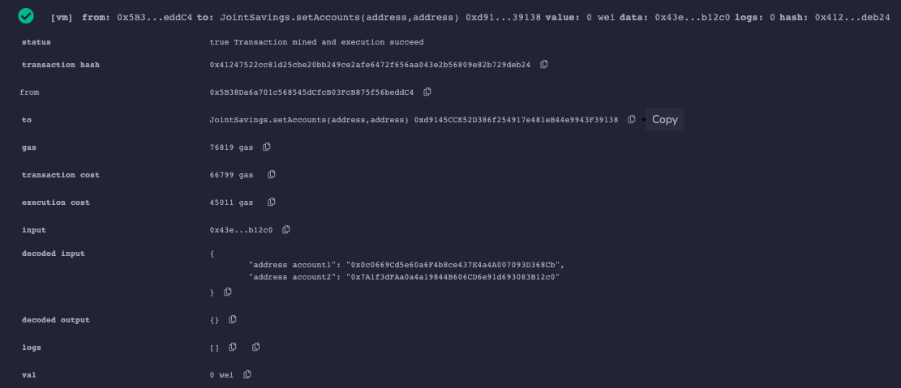

# Blockchain Joint Savings Automation


---

## Description
This project aims to create a Joint Savings Account using Solidity. We first write the contract that holds the funds. We then provide two addresses, the only two addresses that are able to withdraw from the owning account. The testing of this contract is done using [Remix](https://remix-project.org/).

After our contract has been compiled, we test it using the Remix VM. When we inspect our contract and it's functions initially, this is what is looks like.


We can see above that our balance is 0 Ether. Below the balance, we've provided two accounts (our joint accounts) that will be able to withdraw from the contract address.  We can see that our function to set accounts works accordingly by verifying via the logs, which can be seen below.


To test our deposit function, we will make three deposits.
  * Transaction 1: Deposit 1 Ether as Wei.
  
  * Transaction 2: Deposit 10 Ether as Wei.
  
  * Transaction 3: Deposit 5 Ether.
  

We can see from the above images the balance after each deposit. The balance after each of the transactions is 1 Ether, 11 Ether and 16 Ether respectively. Now that our contract address has been deposited 16 Ether in total, we move forward by testing our withdrawal function with our two accounts we've provided. We will do so by making two withdrawals.
  * Transaction 4: Withdraw 5 Ether as Wei to account one.

    
  * Transaction 5: Withdraw 10 Ether as Wei to account two.

    

We're able to see from the above images that our first withdrawal works correctly. Our first withdrawal to account one leaves the contract address with a balance of 11 Ether. We then try to withdraw 10 Ether to our second address. Again, we're able to verify our withdrawal worked correctly as our contract balance is 1 Ether.

At this time, we can verify that all of our functionality is active and working correctly!

---

## Table of Contents
- [Blockchain Joint Savings Automation](#blockchain-joint-savings-automation)
  - [Description](#description)
  - [Table of Contents](#table-of-contents)
  - [1. Installation](#1-installation)
  - [2. Usage](#2-usage)
  - [3. License](#3-license)
  - [4. Contributing](#4-contributing)
  - [5. Tests](#5-tests)
  - [6. Deployment](#6-deployment)
  - [7. Contact](#7-contact)

---

## 1. Installation

  If you would like to clone the repository, type `git clone https://github.com/kheller18/blockchain-joint-savings-automation.git`. Refer to the [Usage](#2-usage) section for required packages

---

## 2. Usage

  After cloning the repository locally, you'll need to have the packages listed in [Installation](#1-installation) installed on your machine. To do so, you'll need to activate your conda dev environment and running the following commands:
  * There are no additional packages that need to be installed.

  After all of these are installed, please refer to the [Deployment](#6-deployment) section for instructions on how to view or edit the notebook.

---

## 3. License
  ```
  MIT License

  Copyright (c) 2023 Keenan Heller

  Permission is hereby granted, free of charge, to any person obtaining a copy
  of this software and associated documentation files (the "Software"), to deal
  in the Software without restriction, including without limitation the rights
  to use, copy, modify, merge, publish, distribute, sublicense, and/or sell
  copies of the Software, and to permit persons to whom the Software is
  furnished to do so, subject to the following conditions:

  The above copyright notice and this permission notice shall be included in all
  copies or substantial portions of the Software.

  THE SOFTWARE IS PROVIDED "AS IS", WITHOUT WARRANTY OF ANY KIND, EXPRESS OR
  IMPLIED, INCLUDING BUT NOT LIMITED TO THE WARRANTIES OF MERCHANTABILITY,
  FITNESS FOR A PARTICULAR PURPOSE AND NONINFRINGEMENT. IN NO EVENT SHALL THE
  AUTHORS OR COPYRIGHT HOLDERS BE LIABLE FOR ANY CLAIM, DAMAGES OR OTHER
  LIABILITY, WHETHER IN AN ACTION OF CONTRACT, TORT OR OTHERWISE, ARISING FROM,
  OUT OF OR IN CONNECTION WITH THE SOFTWARE OR THE USE OR OTHER DEALINGS IN THE
  SOFTWARE.
  ```

---

## 4. Contributing

  + [Keenan Heller](https://github.com/kheller18)

---

## 5. Tests

  + There are currently no tests associated with this project.

---

## 6. Deployment
  + There is currently no live deployment of this app on a common server. To be able to run this app, upload the `joint_savings.sol` file to the [Remix IDE](https://remix-project.org/). Next, compile the contract and deploy it. Upon successfully deployal, you will be able to test the functions of the contract.

---

## 7. Contact

  + [Keenan's LinkedIn](https://www.linkedin.com/in/keenanheller/)

---
